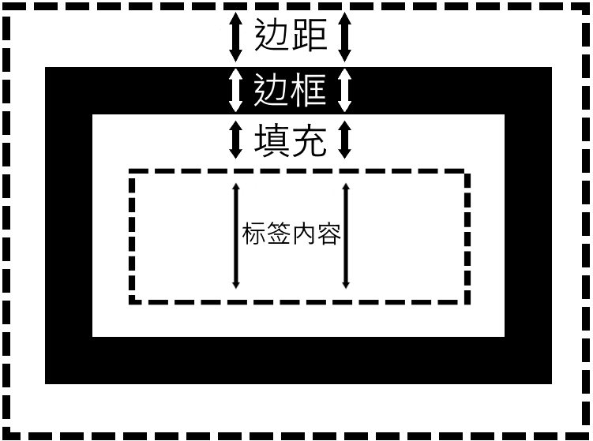
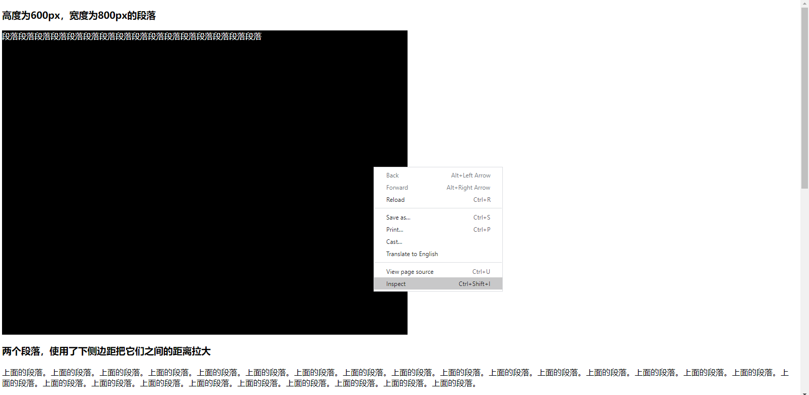
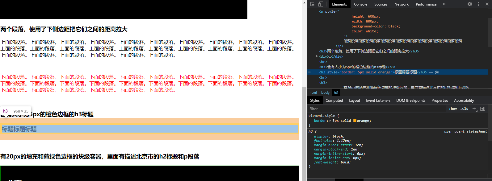
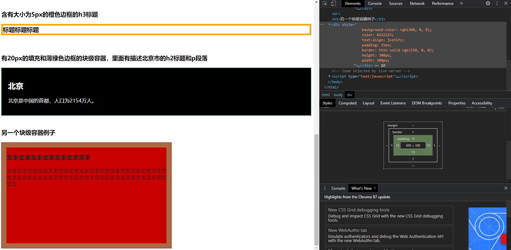
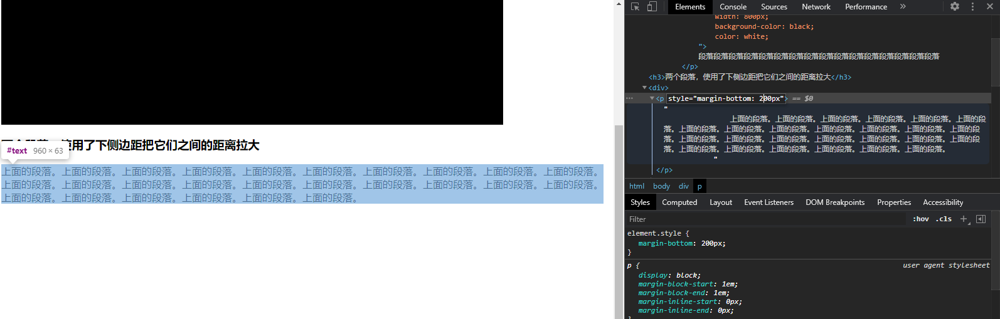

# 8 - HTML的样式(2)

## CSS的盒子模型（The Box Model）
- HTML中所有的元素显示时，都会在最外层被一个的框围住
- 不管是什么元素，显示时占用的空间是以能够围住元素的全部内容的方框为准
- 本节要讨论的设计和内容称为CSS的“盒子模型”

## 盒子模型的四个主要部分
- 盒子模型里的四个主要部分从里到外为：
  - 元素的实际内容
  - 填充：内容外面且方框里面的空间，是透明的
    - 一般用于增加元素所占用的空间
  - 边框：围住内容的边框，是盒子模型的唯一可见部分
  - 边距：
   - 一般用于增加元素和其他元素之间的距离
- 以上边距、边框、填充属于外层的方框，而该方框围住的就是某个元素的实际内容



## HTML元素的高度和宽度
- HTML元素的高度和宽度与CSS盒子模型密切相关
- 元素在某个方向所占用的空间是《高度或宽度》、填充、边框、边距的和
  - 即一个元素的真实宽度是：`(内容宽度) + (左侧填充+右侧填充) + (左侧边框+右侧边框) + (左侧边距+右侧边距)`
  - 而一个元素的真实高度为：`(内容高度) + (上侧填充+下侧填充) + (上侧边框+下侧边框) + (上侧边距+下侧边距)`

## 盒子模型相关的样式属性
- 高度：height
- 宽度：width
- 填充：
  - 上侧：padding-top
  - 右侧：padding-right
  - 下侧：padding-bottom
  - 左侧：padding-left
  - 一次全部定义：`padding: [上] [右] [下] [左];`
    - 如`padding: 1px 2px 3px 4px;`是padding-top为1px、padding-right为2px、padding-bottom为3px、padding-bottom为4px
- 边框：
  - 上侧：border-top
  - 右侧：border-right
  - 下侧：border-bottom
  - 左侧：border-left
  - 一次全部定义：`border: [大小] [类型] [颜色];`
    - 如`border: 2px solid red;`是border-top、border-right、border-bottom、border-left均为2px solid red
- 边距：
  - 上侧：margin-top
  - 右侧：margin-right
  - 下侧：margin-bottom
  - 左侧：margin-left
  - 一次全部定义：`margin: [上] [右] [下] [左];`
    - 如`margin: 1px 2px 3px 4px;`是margin-top为1px、margin-right为2px、margin-bottom为3px、margin-bottom为4px

例子

高度为600px，宽度为800px的段落
```html
<p style="height: 600px; width: 800px; background-color: black; color: white;">段落</p>
```

两个段落，使用了下侧边距把它们之间的距离拉大
```html
<div>
  <p style="margin-bottom: 50px;">上面的段落。上面的段落。上面的段落。上面的段落。上面的段落。上面的段落。上面的段落。上面的段落。上面的段落。上面的段落。上面的段落。上面的段落。上面的段落。上面的段落。上面的段落。上面的段落。上面的段落。上面的段落。上面的段落。上面的段落。上面的段落。上面的段落。上面的段落。上面的段落。上面的段落。上面的段落。</p>

  <p style="color: red;">下面的段落。下面的段落。下面的段落。下面的段落。下面的段落。下面的段落。下面的段落。下面的段落。下面的段落。下面的段落。下面的段落。下面的段落。下面的段落。下面的段落。下面的段落。下面的段落。下面的段落。下面的段落。下面的段落。下面的段落。下面的段落。下面的段落。下面的段落。下面的段落。下面的段落。下面的段落。</p>
</div>
```

含有大小为5px的橙色边框的h3标题
```html
<h3 style="border: 5px solid orange;">段落</h3>
```

有20px的填充和薄绿色边框的块级容器，里面有描述北京市的h2标题和p段落
```html
<div style="background-color: black; color: white; padding: 20px; border: thin solid green;">
  <h2>北京</h2>
  <p>北京是中国的首都，人口为2154万人。</p>
</div>
```

```html
<div style="background-color: rgb(200, 0, 0); color: #222222; text-align: justify; padding: 15px; border: thin solid rgb(150, 0, 0); height: 300px; width: 500px;">
  <h3>文本文本文本文本文本文本文本</h3>
  <p>文本文本文本文本文本文本文本文本文本文本文本文本文本文本文本文本文本文本文本文本文本文本文本文本文本文本文本文本文本文本文本文本</p>
</div>
```

之前有讲过图像标签的宽度和高度标签属性：
```html

```
但是也可以使用宽度和高度的样式属性来实现：
```html

```
之后建议使用样式属性来实现图像元素的宽度和高度设置。如果使用标签属性实现也可以，但是之后会学习如何设置全局样式，并且使用全局样式设置图像的宽度和高度会覆盖图像标签的宽度和高度标签属性，而不会覆盖图像标签的宽度和高度样式属性

## 浏览器开发者工具的使用
- 引入了盒子模型，就可以说浏览器的开发工具了
- 打开了任何一个HTML文件，都可以在页面里右击，并点击“Inspect (Element)”或“检查（元素）”



- 开发者工具打开了之后，可以在Elements（元素）里把鼠标放在HTML元素来加亮它，即可看某个元素在哪里。也可以查看元素的属性，包括样式属性



- 也可以查看某个元素的盒子，以便于清晰地看明白边距、边框、填充和元素的内容分别在哪里并占用了多少空间



- 也可以修改某个元素当前的代码



- 浏览器开发者工具是非常有用的工具。在之后的练习和项目开发中，用到开发者工具可以很好的调试你的代码